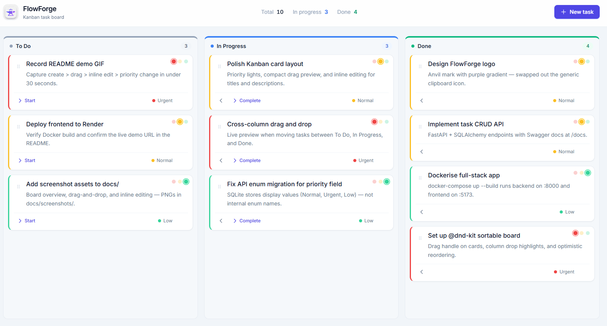
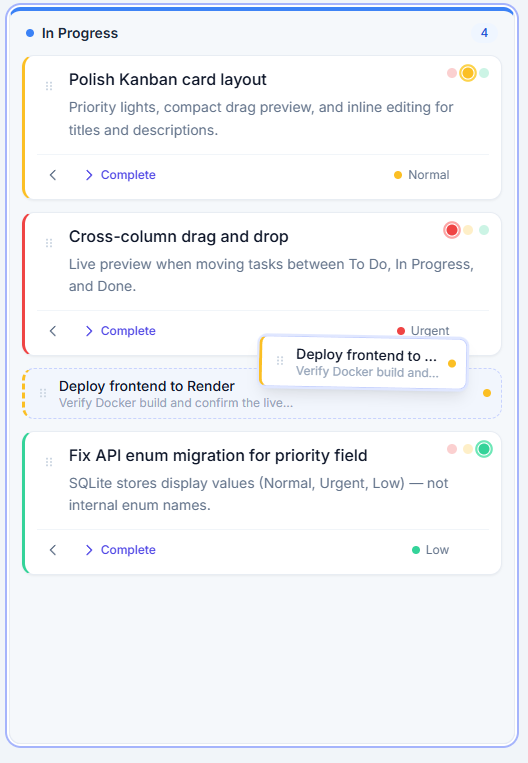
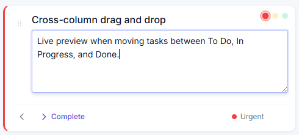

# FlowForge


A full-stack Kanban task board built with React and FastAPI. Create tasks, drag them across columns, edit details inline, and set priority — all backed by a documented REST API and Dockerised deployment.

**Live demo:** [Flowforge.com](https://flowforge-cha7.onrender.com)  
**API docs (demo):** [Flowforge.com/docs](https://flowforge-backend-bwtn.onrender.com/docs)

---

## Demo

[](https://youtu.be/bdOTCCxjpHM)

Click the thumbnail to watch on YouTube.

---

## Screenshots

| Board overview | Drag & drop | Inline editing |
|---|---|---|
|  |  |  |


---

## Features

- **Kanban workflow** — organise tasks across *To Do*, *In Progress*, and *Done*
- **Drag and drop** — move and reorder tasks within and between columns (`@dnd-kit`)
- **Inline editing** — double-click titles and descriptions to edit in place
- **Priority levels** — Urgent, Normal, and Low with colour-coded indicators
- **REST API** — full CRUD with auto-generated Swagger UI
- **Dockerised** — single-command local setup for frontend and backend

---

## Tech Stack

| Layer | Technologies |
|-------|-------------|
| **Frontend** | React 19, TypeScript, Vite, Tailwind CSS, Axios, `@dnd-kit` |
| **Backend** | Python, FastAPI, Pydantic, SQLAlchemy |
| **Database** | SQLite (development) |
| **DevOps** | Docker, Docker Compose, Nginx |

---

## Project Structure

```
Full-Stack-Task-Management-Issue-Tracker-App/
├── README.md
└── flowforge/
    ├── docker-compose.yml
    ├── backend/          # FastAPI + SQLAlchemy
    └── frontend/         # React + Vite
```

---

## Getting Started

### Prerequisites

- [Docker Desktop](https://www.docker.com/products/docker-desktop/)

### Run locally

1. **Clone the repository**

   ```bash
   git clone https://github.com/nlankelis/FlowForge.git
   cd Full-Stack-Task-Management-Issue-Tracker-App/flowforge
   ```

2. **Start the application**

   ```bash
   docker-compose up --build
   ```

3. **Open the app**

   | Service | URL |
   |---------|-----|
   | Frontend (task board) | http://localhost:5173 |
   | Backend API | http://localhost:8000 |
   | Swagger docs | http://localhost:8000/docs |

### Run without Docker (optional)

**Backend**

```bash
cd flowforge/backend
python -m venv venv
venv\Scripts\activate        # Windows
pip install -r requirements.txt
uvicorn main:app --reload
```

**Frontend**

```bash
cd flowforge/frontend
npm install
npm run dev
```

---

## API Overview

| Method | Endpoint | Description |
|--------|----------|-------------|
| `GET` | `/tasks/` | List all tasks |
| `POST` | `/tasks/` | Create a task |
| `GET` | `/tasks/{id}` | Get a task |
| `PATCH` | `/tasks/{id}` | Update a task |
| `DELETE` | `/tasks/{id}` | Delete a task |

Tasks support `title`, `description`, `status` (*To Do* / *In Progress* / *Done*), and `priority` (*Urgent* / *Normal* / *Low*).

---

## Deployment

FlowForge is deployed on **[Render](https://flowforge-cha7.onrender.com)**.

---

## What I'd Add Next

- User authentication (JWT, per-user boards)
- Task due dates and filtering
- PostgreSQL for production persistence

---

## Author

**[Nojus Lankelis](https://github.com/nlankelis)**

**[LinkedIn](https://www.linkedin.com/in/nojus-lankelis/)**

---

## Licence

This project is open source and available for portfolio and educational use.